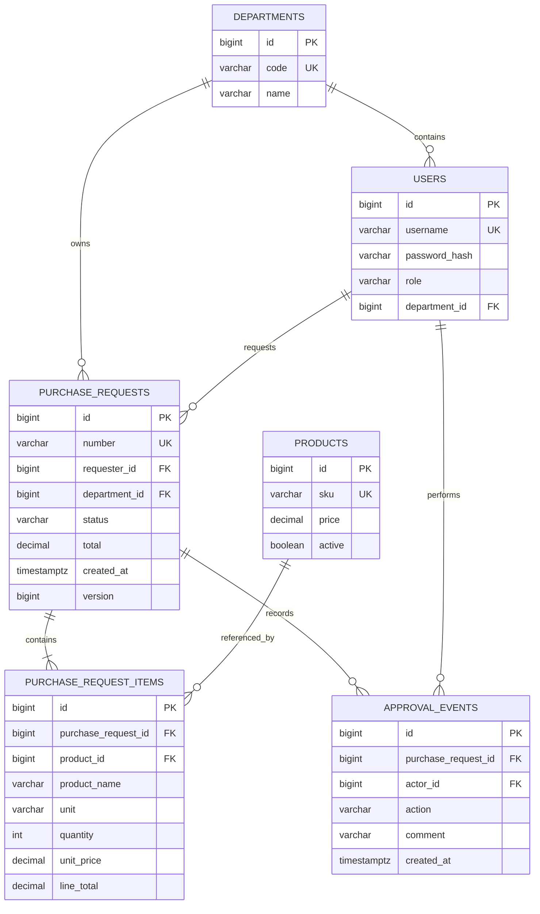

# ER diagram

```mermaid
erDiagram
    DEPARTMENTS ||--o{ USERS : contains
    DEPARTMENTS ||--o{ PURCHASE_REQUESTS : owns
    USERS ||--o{ PURCHASE_REQUESTS : requests
    PURCHASE_REQUESTS ||--|{ PURCHASE_REQUEST_ITEMS : contains
    PRODUCTS ||--o{ PURCHASE_REQUEST_ITEMS : referenced_by
    PURCHASE_REQUESTS ||--o{ APPROVAL_EVENTS : records
    USERS ||--o{ APPROVAL_EVENTS : performs
    DEPARTMENTS {
        bigint id PK
        varchar code UK
        varchar name
    }
    USERS {
        bigint id PK
        varchar username UK
        varchar password_hash
        varchar role
        bigint department_id FK
    }
    PRODUCTS {
        bigint id PK
        varchar sku UK
        decimal price
        boolean active
    }
    PURCHASE_REQUESTS {
        bigint id PK
        varchar number UK
        bigint requester_id FK
        bigint department_id FK
        varchar status
        decimal total
        timestamptz created_at
        bigint version
    }
    PURCHASE_REQUEST_ITEMS {
        bigint id PK
        bigint purchase_request_id FK
        bigint product_id FK
        varchar product_name
        varchar unit
        int quantity
        decimal unit_price
        decimal line_total
    }
    APPROVAL_EVENTS {
        bigint id PK
        bigint purchase_request_id FK
        bigint actor_id FK
        varchar action
        varchar comment
        timestamptz created_at
    }
```

หนึ่งองค์กรหลายแผนก บทบาทเป็น enum 3 ค่า ยังไม่มี companies/roles/permissions แบบตาราง
Schema หลักอยู่ backend/erp-api/src/main/resources/db/migration/V1__initial_schema.sql
