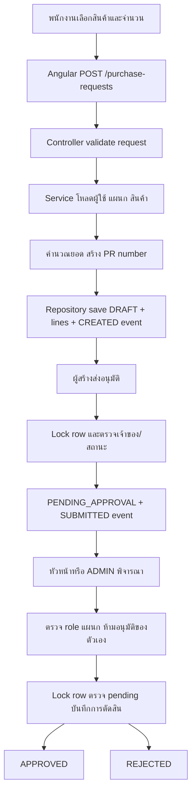

# Flow การขอซื้อ

```mermaid
flowchart TD
    A[พนักงานเลือกสินค้าและจำนวน] --> B[Angular POST /purchase-requests]
    B --> C[Controller validate request]
    C --> D[Service โหลดผู้ใช้ แผนก สินค้า]
    D --> E[คำนวณยอด สร้าง PR number]
    E --> F[Repository save DRAFT + lines + CREATED event]
    F --> G[ผู้สร้างส่งอนุมัติ]
    G --> H[Lock row และตรวจเจ้าของ/สถานะ]
    H --> I[PENDING_APPROVAL + SUBMITTED event]
    I --> J[หัวหน้าหรือ ADMIN พิจารณา]
    J --> K[ตรวจ role แผนก ห้ามอนุมัติของตัวเอง]
    K --> L[Lock row ตรวจ pending บันทึกการตัดสิน]
    L --> M[APPROVED]
    L --> N[REJECTED]
```

SUBMITTED เป็น audit event สถานะหลังส่งคือ PENDING_APPROVAL ทันที
PO_CREATED ยังไม่ใช้เพราะยังไม่มี PO; เอกสารปฏิเสธให้สร้างใหม่
